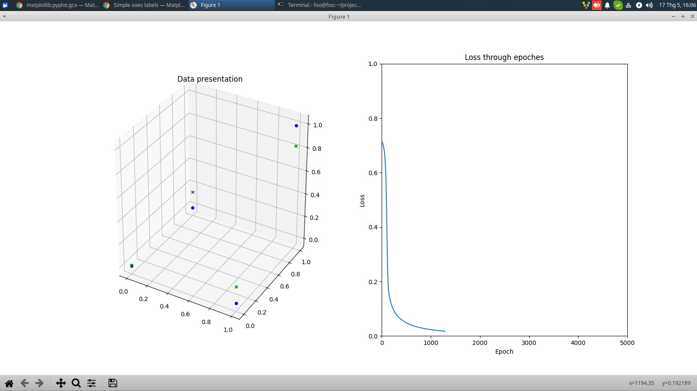

## Requirement
Install following requirements if your device do not all all of the followings
(On Windows/MacOSX, pip is preferrable)
```
pip3 install tensorflow==2.0.0a0
pip3 install matplotlib
```

## How to execute ?
- On Linux
```
python3 main.py
```
- On Windows/MacOSX

```
python main.py
```
## Screenshot


## Explore what I am doing ?
Go to my script for more detail about training steps
